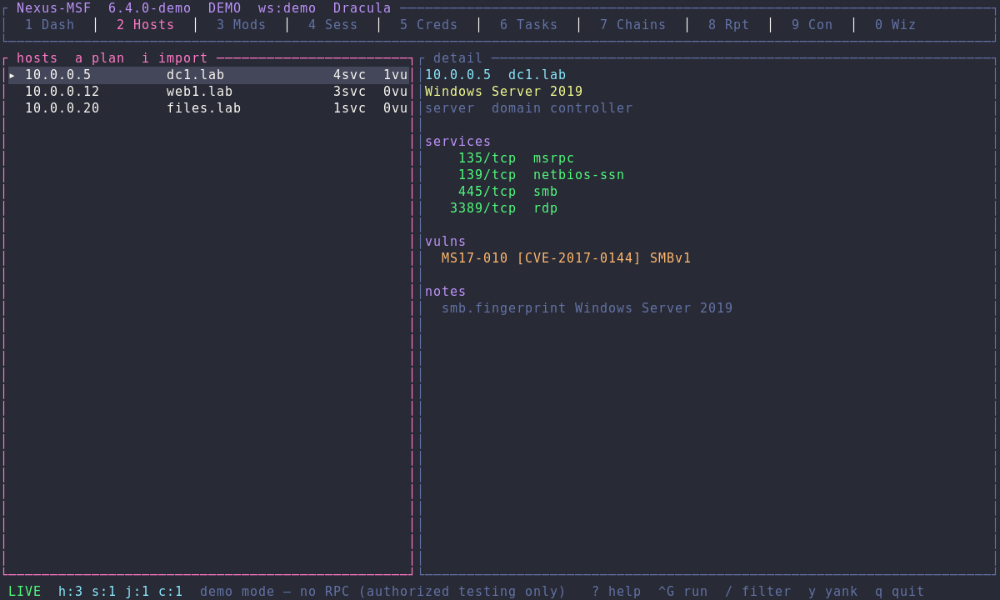

# Nexus-MSF

Dracula-themed terminal frontend for [Metasploit Framework](https://github.com/rapid7/metasploit-framework). Drive `msfrpcd` from numbered tabs: hosts, modules, sessions, credentials, task chains, reports, an embedded console, and Pro-style wizards (auto-exploit *plan*, vuln validation, credential reuse, evidence macros, msfvenom).



This wraps Framework. It does not reimplement exploits, ship payloads, or talk to Rapid7 Metasploit Pro.

Only use against systems you own or have written permission to test.

## Install

```sh
curl -fsSL https://raw.githubusercontent.com/kensmith77/Nexus-MSF/main/install.sh | sh
```

From a clone (needs `cc`, e.g. `sudo apt-get install build-essential pkg-config`):

```sh
cargo install --path . --locked
```

Framework itself (required for live RPC; `--demo` works without it):

```sh
sudo apt install metasploit-framework    # Debian/Kali
msfdb init
```

## Usage

```sh
nexus-msf --demo          # sample workspace, no RPC
nexus-msf                 # connect to msfrpcd (Ctrl-G on Dash)
NEXUS_MSF_RPC_PASS=secret nexus-msf --host 127.0.0.1 --port 55553 --no-ssl
```

On first run a password is written to `~/.config/nexus-msf/config.toml` (mode `0600`). Spawned `msfrpcd` binds **127.0.0.1** only. Remote spawn is refused.

## Keys

| Key | Action |
|---|---|
| `1`–`9`, `0` | Dash / Hosts / Mods / Sess / Creds / Tasks / Chains / Reports / Console / Wizards |
| `Tab` | Cycle pane / module type / wizard |
| `Ctrl-G` | Primary action (connect, execute, discover, chain, report, plan) |
| `y` | Copy selection |
| `/` | Filter |
| `?` | Help |
| `q` | Quit |

Hosts: `a` auto-exploit plan, `i` import path. Modules: `t` type, `f` favorite, Enter option. Sessions: `i` interact. Wizards: `space` toggle plan item, `+/-` min rank.

## What this adds on top of Framework

Independent workflows, not Rapid7 Pro:

- Workspace dashboard and audit log
- Host / service / vuln browser + nmap/Nessus XML import (`db.import_data`)
- Module search, option editor, favorites, `module.execute`
- Session list, interact, stop, route display
- Credential + loot browser, reuse via login scanners
- Explainable auto-exploit **plan** (CVE/service/OS/rank) — nothing runs until you confirm
- Task chains (TOML) and post-exploit evidence macros
- HTML/Markdown/JSON reports (Dracula HTML)
- msfvenom form (subprocess)
- Embedded msfconsole via `console.write` / `console.read`

Out of scope: phishing campaigns, Rapid7 exclusive modules, VPN pivoting, Pro APIs.

## Theme

Official [Dracula](https://spec.draculatheme.com/) palette, truecolor. Use a terminal with 24-bit color (`kitty`, `wezterm`, `ghostty`, recent `alacritty`).

## Data

```
~/.config/nexus-msf/config.toml
~/.local/share/nexus-msf/audit.jsonl
~/.local/share/nexus-msf/chains/*.toml
~/.local/share/nexus-msf/macros/*.toml
~/.local/share/nexus-msf/reports/<timestamp>-<workspace>/
```
